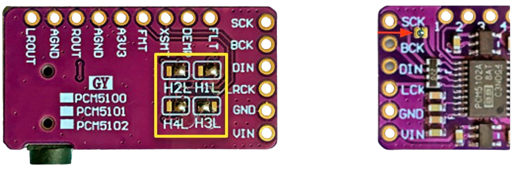
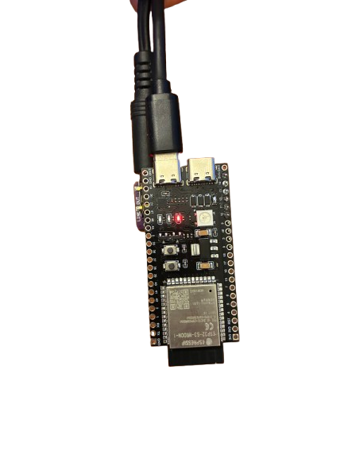
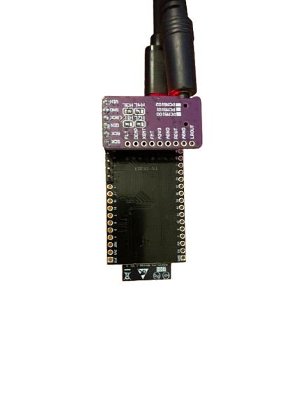
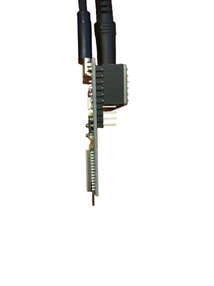

<div align="center">

# ESP32 AirPlay 2 Receiver

[](https://github.com/rbouteiller/airplay-esp32/stargazers)
[](https://github.com/rbouteiller/airplay-esp32/network)
[](LICENSE)
[](https://docs.espressif.com/projects/esp-idf/)
[](https://www.espressif.com/en/products/socs/esp32-s3)

**Stream music from your Apple devices to any speaker for ~10$**

</div>

---

## What is this?

This turns a cheap ESP32-S3 board into a wireless AirPlay 2 speaker. Plug it into any amplifier or powered speakers, and it shows up on your iPhone/iPad/Mac just like a HomePod or AirPlay TV.

**No cloud. No app. Just tap and play.**

---

## Shopping List

You only need 2 boards and a few wires. Everything is available on AliExpress / Amazon for under 10$.

| Component                | What to search for                                                      | Price |
| ------------------------ | ----------------------------------------------------------------------- | ----- |
| **ESP32-S3 dev board**   | "ESP32-S3 N16R8" (must have **8MB PSRAM**)                              | ~5$   |
| **PCM5102A DAC board**   | "PCM5102A I2S DAC" (the small purple board with 3.5mm jack)             | ~3$   |
| **Female 2.54mm header** | "Female pin header 2.54mm single row" (1x6 or longer, then cut to size) | ~0.5$ |

> **Important:** The ESP32-S3 must have **8MB PSRAM** (the N16R8 variant). Boards without enough PSRAM will not work — the audio decoding needs the extra memory.

Here is what the PCM5102A board looks like:
Verify the solder bridges are in the same position as the picture.

<div align="center">

</div>

---

## Assembly (No Soldering Skills Needed)

The PCM5102A plugs directly onto the ESP32 pins using a female header — no breadboard, no jumper wires.

### Step 1 — Prepare the ESP32

The pins on **one side** of the ESP32 need to be removed (or not soldered on) so the assembly fits inside the 3D-printed case. Only the side with GPIO11–GPIO14 needs pins.

If your board came with pins on both sides already soldered, you can carefully desolder or clip the pins on the opposite side.

### Step 2 — Plug the DAC onto the ESP32

Take a **female 2.54mm pin header** (6 pins) and plug it onto the ESP32 pins on the side with GPIO11–14. Then insert the PCM5102A board into the female header from the other side.

The connections through the header are:

```
ESP32-S3 pin     →  PCM5102A pin    What it does
─────────────────────────────────────────────────
5V               →  VIN             Power for the DAC
GND              →  GND             Ground
GPIO11           →  BCK             Bit clock (audio timing)
GPIO12           →  DIN             Audio data
GPIO13           →  LCK             Left/right channel select
GPIO14           →  GND             Software ground (pulled low by code)
```

> **Tip:** On the ESP32S3 board, bridge the VIN/VOUT solder pads if they are not already connected. This lets the board use 5V power directly.

### Step 3 — Check the result

Your assembly should look like this:

<div align="center">

|                              Front                              |                             Back                              |                              Side                               |
| :-------------------------------------------------------------: | :-----------------------------------------------------------: | :-------------------------------------------------------------: |
|  |  |  |

</div>

The PCM5102A sits on top of the ESP32 and the 3.5mm audio jack sticks out the end. Plug a USB-C cable into the ESP32 for power.

### Step 4 — (Optional) Print the case

A 3D-printable case is provided in [`docs/boite esp32.stl`](docs/boite%20esp32.stl). Print it with standard PLA settings. The case is designed for the assembly with pins on one side only.

---

## Flash the Firmware

You have two options: **PlatformIO** (easier) or **ESP-IDF** (official Espressif toolchain).

### Option A — PlatformIO (Recommended for beginners)

[PlatformIO](https://platformio.org/) handles all the toolchain setup for you.

```bash
# 1. Install PlatformIO CLI
pip install platformio

# 2. Clone this project
git clone https://github.com/rbouteiller/airplay-esp32
cd airplay-esp32

# 3. Plug in your ESP32 via USB-C and flash
pio run -e esp32s3 -t upload

# 4. (Optional) Watch serial output for debugging
pio run -e esp32s3 -t monitor
```

### Option B — ESP-IDF

```bash
# 1. Install ESP-IDF v5.x following:
#    https://docs.espressif.com/projects/esp-idf/en/latest/esp32/get-started/

# 2. Clone and enter the project
git clone https://github.com/rbouteiller/airplay-esp32
cd airplay-esp32
git submodule update --init --recursive

# 3. Activate ESP-IDF environment
source /path/to/esp-idf/export.sh

# 4. Build and flash
idf.py set-target esp32s3
idf.py build
idf.py -p /dev/ttyUSB0 flash

# 5. (Optional) Monitor serial output
idf.py -p /dev/ttyUSB0 monitor
```

---

## Setup (First Boot)

1. **Power up** the ESP32 via USB-C
2. On your phone or laptop, connect to the WiFi network **`ESP32-AirPlay-Setup`**
3. A captive portal will open. (IP: 192.168.4.1)
4. Set a name for your speaker (e.g. "Kitchen Speaker")
5. Select your home WiFi network and set a password
6. The device restarts and connects to your WiFi
7. Open any music app, tap the AirPlay icon, and select your speaker

That's it! Settings are saved and persist across reboots.

> **If WiFi connection fails** after several retries, the ESP32 automatically goes back into setup mode so you can reconfigure it.

---

## Updating the Firmware (OTA)

Once the device is connected to your WiFi, you can update the firmware wirelessly without unplugging anything:

1. Build the new firmware (`idf.py build` or `pio run`)
2. Open the device's web interface (find its IP in your router's connected devices list)
3. Use the firmware upload page to flash the new version

---

## Features

- **AirPlay 2 protocol** — shows up natively in Control Center and all AirPlay apps
- **ALAC & AAC decoding** — handles both live streaming (Siri, calls) and music playback
- **Multi-room support** — PTP-based timing for synchronized playback across devices
- **Web configuration** — set up WiFi and device name from your browser
- **OTA updates** — update firmware over WiFi, no USB needed after first flash
- **LED indicator** — visual feedback for playback status

### Limitations

- Audio only (no AirPlay video or photos)
- One speaker per ESP32 board
- Needs decent WiFi signal for stable streaming

---

## Technical Details

### Signal Flow

```
┌─────────────────┐      WiFi       ┌─────────────┐
│  iPhone / Mac   │ ─────────────►  │   ESP32-S3  │
│    (AirPlay)    │                 │             │
└─────────────────┘                 └──────┬──────┘
                                           │ I2S
                                    ┌──────▼──────┐
                                    │  PCM5102A   │
                                    │    DAC      │
                                    └──────┬──────┘
                                           │ Analog
                                    ┌──────▼──────┐
                                    │  Amplifier  │
                                    │  + Speakers │
                                    └─────────────┘
```

### I2S Signals

| Signal | Function                              |
| ------ | ------------------------------------- |
| BCK    | Bit clock — 44100 × 16 × 2 = 1.41 MHz |
| LCK    | Word select — toggles at 44.1 kHz     |
| DIN    | Serial audio data (16-bit stereo)     |

MCLK is not used; the PCM5102A generates it internally.

### Protocol Stack

```
┌────────────────────────────────────────────────┐
│              AirPlay 2 Source                  │
│         (iPhone, iPad, Mac, Apple TV)          │
└───────────────────────┬────────────────────────┘
                        │
          ┌─────────────┼─────────────┐
          ▼             ▼             ▼
    ┌──────────┐  ┌──────────┐  ┌──────────┐
    │   mDNS   │  │   RTSP   │  │   PTP    │
    │ Discovery│  │ Control  │  │  Timing  │
    └──────────┘  └──────────┘  └──────────┘
          │             │             │
          └─────────────┼─────────────┘
                        ▼
              ┌──────────────────┐
              │   HAP Pairing    │
              │  (Transient)     │
              └──────────────────┘
                        │
                  ┌───────────┐
                  ▼           ▼
            ┌──────────┐ ┌──────────┐
            │   ALAC   │ │   AAC    │
            └──────────┘ └──────────┘
                  │           │
                  └─────┬─────┘
                        ▼
              ┌──────────────────┐
              │   Audio Buffer   │
              │  + Timing Sync   │
              └──────────────────┘
                        │
                        ▼
              ┌──────────────────┐
              │    I2S Output    │
              │   (44.1kHz/16b)  │
              └──────────────────┘
```

### Audio Formats

| Format          | Use Case             |
| --------------- | -------------------- |
| ALAC (realtime) | Live streaming, Siri |
| AAC (buffered)  | Music playback       |

### Key Components

| Module             | Location        | Purpose                          |
| ------------------ | --------------- | -------------------------------- |
| **RTSP Server**    | `main/rtsp/`    | Handles AirPlay control messages |
| **HAP Pairing**    | `main/hap/`     | Cryptographic device pairing     |
| **Audio Pipeline** | `main/audio/`   | Decoding, buffering, timing      |
| **PTP Clock**      | `main/network/` | Synchronization with source      |
| **Web Server**     | `main/network/` | Configuration interface          |

### Project Structure

```
main/
├── audio/          # Decoders, buffers, timing sync
├── rtsp/           # RTSP server and handlers
├── hap/            # HomeKit pairing (SRP, Ed25519)
├── plist/          # Binary plist parsing
├── network/        # WiFi, mDNS, PTP, web server
├── main.c          # Entry point
└── settings.c      # NVS persistence
```

---

## Acknowledgements

- **[Shairport Sync](https://github.com/mikebrady/shairport-sync)** — The reference AirPlay implementation
- **[openairplay/airplay2-receiver](https://github.com/openairplay/airplay2-receiver)** — Python AirPlay 2 implementation
- **[Espressif](https://github.com/espressif)** — ESP-IDF framework and codec libraries

---

## Legal

**Non-commercial use only.** Commercial use requires explicit permission. See [LICENSE](LICENSE).

This is an independent project based on protocol analysis. Not affiliated with Apple Inc. Not guaranteed to work with future iOS/macOS versions. Provided as-is without warranty.
