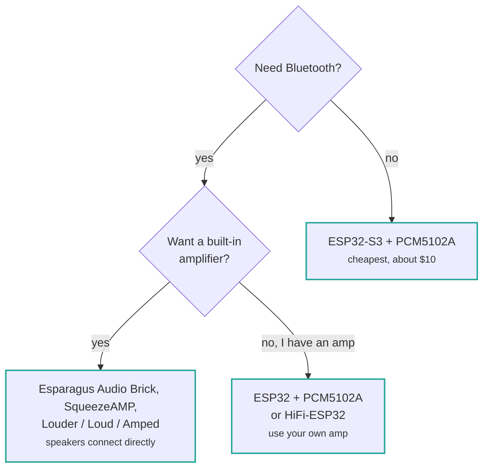

# Supported boards

Pick the page matching your hardware. If you are building from parts rather than using an
integrated board, you want [ESP32-S3 + PCM5102A](esp32s3-pcm5102a.md).

## Which board should I buy?

If you already own one of these, just find it in the table below. If you are starting from
nothing, the only question that really matters is whether you need Bluetooth.

The short version: **buy an ESP32-S3** unless you need Bluetooth, in which case you need an
original ESP32.

| Board | Chip | DAC / amp | Bluetooth | Ethernet | Prebuilt binary |
| --- | --- | --- | :-: | :-: | :-: |
| [ESP32-S3 + PCM5102A](esp32s3-pcm5102a.md) | ESP32-S3 | External I2S | — | — | yes |
| [Waveshare ESP32-S3](esp32s3-pcm5102a.md#waveshare-esp32-s3) | ESP32-S3 | External I2S | — | — | yes |
| [SqueezeAMP](squeezeamp.md) | ESP32 | TAS5756 | yes | — | yes |
| [Esparagus Audio Brick](esparagus-audio-brick.md) | ESP32 / S3 | TAS58xx | ESP32 only | yes | yes |
| [Esparagus Audio Brick Dual](esparagus-audio-brick-dual-dac.md) | ESP32-S3 | 2× TAS58xx | — | yes | yes |
| [Esparagus Louder](esparagus-audio-brick.md#esparagus-louder) | ESP32 / S3 | TAS58xx | ESP32 only | yes | yes |
| [HiFi-ESP32](hifi-esp32.md) | ESP32 / S3 | PCM5100, line level | ESP32 only | yes | yes |
| [HiFi-Esparagus](hifi-esp32.md) | ESP32 / S3 | PCM5100, line level | ESP32 only | — | yes |
| [Loud-ESP32](loud-esp32.md) | ESP32 / S3 | MAX98357A | ESP32 only | yes | yes |
| [Loud-Esparagus](loud-esp32.md) | ESP32 | 2× MAX98357A | yes | — | yes |
| [Esparagus Echo](loud-esp32.md) | ESP32-S3 | 2× MAX98357A | — | yes | yes |
| [Amped-ESP32](amped-esp32.md) | ESP32 / S3 | PCM5100 + TPA31xx | ESP32 only | yes | yes |
| [Amped-Esparagus](amped-esp32.md) | ESP32 | PCM5100 + TPA31xx | yes | yes | yes |
| [Louder-ESP32](louder-esp32.md) | ESP32 / S3 | TAS5805M | ESP32 only | yes | yes |
| [Louder-ESP32-Plus](louder-esp32.md) | ESP32 / S3 | TAS5825M | ESP32 only | yes | yes |
| [Seeed XIAO ESP32-C5](xiao-esp32c5.md) | ESP32-C5 | External I2S | — | — | — |
| [Custom board](custom.md) | any | any | — | — | — |

**Bluetooth Classic A2DP is only available on the original ESP32.** The ESP32-S3, S2 and
C5 have Bluetooth LE only, or no Bluetooth at all, so A2DP is not possible on them. If
Bluetooth matters to you, choose an ESP32-based board.

## Choosing a chip

| Chip | Notes |
| --- | --- |
| **ESP32-S3** | The best default. Plenty of PSRAM, native USB, actively developed against. |
| **ESP32** | Choose this for Bluetooth A2DP. Tighter on RAM, so audio buffers are halved. |
| **ESP32-S2** | Works, but single core and no Bluetooth. Prebuilt binary available. |
| **ESP32-C5** | Dual-band WiFi 6, RISC-V. Needs a community PlatformIO platform — see [its page](xiao-esp32c5.md). |
| **ESP32-P4** | Experimental. A `config/sdkconfig.defaults.esp32p4` exists but there is no PlatformIO environment. |

## Full build environment list

Every PlatformIO environment, including variants without prebuilt binaries, is listed in
[build environments](../reference/build-environments.md).
