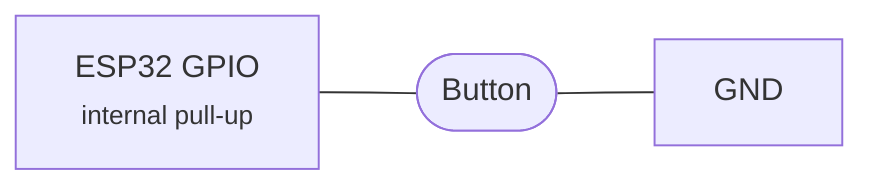

# Hardware buttons

Physical buttons can control playback directly from the device, with no phone involved.
They work with both AirPlay and Bluetooth sources — but there is an important caveat for
AirPlay, covered below.

## Read this first: the AirPlay v1 requirement

Button-driven remote control (play/pause, next/previous track) relies on **DACP**, a
protocol where iOS sends a session ID and port that the receiver uses to send commands
back to the source. **iOS only sends DACP headers in AirPlay v1 (classic) mode.** In
AirPlay 2 mode Apple uses MRP (Media Remote Protocol) instead, which this firmware does not
implement.

In practice:

| Source | Volume | Play/pause and track skip |
| --- | --- | --- |
| **AirPlay 2** (default) | Works, applied locally on the DAC | Falls back to local mute — cannot control the source |
| **AirPlay v1** (forced) | Works | Works fully via DACP |
| **Bluetooth** | Works | Works fully via AVRCP passthrough |

To get full button control over AirPlay, switch the receiver to v1 mode in the web
interface: **Device Settings → AirPlay Mode → Legacy (v1)**, then restart the
device.

!!! warning "Trade-off"

    AirPlay v1 disables AirPlay 2 features: HomeKit pairing, encrypted transport and
    multi-room sync. The device still appears in AirPlay menus on iOS, but as a classic
    receiver. Bluetooth is unaffected.

## Supported actions

| Button | Action |
| --- | --- |
| Play/pause | Toggle playback |
| Volume up | Increase volume, roughly 3 dB per step, auto-repeats |
| Volume down | Decrease volume, roughly 3 dB per step, auto-repeats |
| Next track | Skip to the next track |
| Previous | Go to the previous track |

Volume buttons auto-repeat: hold for 500 ms and the action repeats every 200 ms.

## Wiring

Buttons are **active-low** — wire each one between its GPIO and GND.



No resistor is needed on most pins; the internal pull-up holds the line high while the
button is open.

- Internal pull-ups are enabled automatically on GPIOs 0–33.
- GPIOs 34–39 are input-only on the ESP32 and have no internal pull-up, so they need an
  **external pull-up resistor**. The driver warns at boot if you use one of them.

Input is interrupt-driven with a 50 ms software debounce, so there is no polling overhead.
Actions are dispatched to whichever source is active: DACP for AirPlay v1, AVRCP
passthrough for Bluetooth.

## Configuration

All button GPIOs default to `-1`, meaning disabled.

```bash
idf.py menuconfig
# AirPlay Receiver → Button Configuration
# Set each GPIO pin, or leave at -1 to disable
```

With PlatformIO:

```bash
pio run -e <env> -t menuconfig
```

| Option | Default | Description |
| --- | --- | --- |
| Play/pause button GPIO | -1 | GPIO for play/pause |
| Volume up button GPIO | -1 | GPIO for volume up, auto-repeats |
| Volume down button GPIO | -1 | GPIO for volume down, auto-repeats |
| Next track button GPIO | -1 | GPIO for next track |
| Previous track button GPIO | -1 | GPIO for previous track |

!!! note

    The button driver installs the shared GPIO ISR service (`board_gpio_isr_init()`)
    itself if the board support layer has not already done so.
