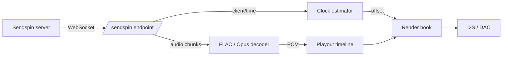

# Sendspin (experimental)

[Sendspin](https://github.com/Sendspin/sendspin-cpp) is an open multi-room audio protocol: a
server pushes timestamped audio chunks to every player over a WebSocket, and each player
schedules them against a shared clock. This firmware can act as a Sendspin **player**,
sharing the same output path, DSP and volume control that AirPlay uses.

!!! warning "Experimental"

    PCM and FLAC are decoded everywhere, and Opus on the ESP32-S3 and P4.
    Everything else about a session is in place: the transport is
    encrypted, and the board can be paired so that it is authenticated too.

## What works

- Discovery: the board advertises `_sendspin._tcp`
- The full `client/init` → `server/init` → Noise handshake → `server/hello` →
  `client/hello` → `server/activate` sequence
- An **encrypted** transport: Noise `KKpsk2` over Curve25519, ChaCha20-Poly1305 and
  SHA-256, keyed with the Sentinel PSK
- Continuous clock sync, so playback is aligned with the server rather than free-running
- The `player@v1` role: 16- and 24-bit PCM, mono or stereo, 8–192 kHz in, played out as
  44.1 or 48 kHz stereo
- **FLAC**, which is what a lossless server will reach for first and what cuts the
  bandwidth a 44.1 kHz stereo stream needs from about 1.4 Mbit/s to roughly half that
- **Opus** at 48 kHz, on boards whose SoC can keep up — see
  [Opus](#opus) below
- Stream start, clear and end, including re-anchoring when the server jumps
- The `metadata@v1` role: title, artist, album and progress reach the
  [OLED](oled-display.md) and [TFT](tft-display.md) displays and the LEDs on the same
  event bus AirPlay and Bluetooth use, so a board that powers its amplifier down between
  tracks wakes for a Sendspin stream too
- Volume and mute: the server can set either, and the board reports its own back — so a
  change made with the [hardware buttons](buttons.md) or the
  [web UI](../reference/spiffs.md) shows up in the server's UI
- The `controller@v1` role: the board's play/pause, next and previous buttons drive the
  server's queue, the way DACP does for AirPlay
- **Two pairing methods**: a **static PIN**, an eight-digit code the board prints at boot,
  and the **Pairing PSK** the specification requires of every client. Either way the two
  ends agree a long-term key and the connection becomes authenticated rather than merely
  encrypted. See [Pairing](#pairing)
- **In-band re-handshaking**: a server promoting a live connection onto a new key — which is
  what it does the moment pairing finishes — re-runs the Noise handshake inside the existing
  session rather than reconnecting

## What does not

- **The dynamic pairing code.** It needs a display or a spoken prompt the board does not
  have, so only the static code is offered
- **Opus on the original ESP32.** It is offered only where the SoC can decode it in
  realtime; see [Opus](#opus)
- The artwork and visualizer roles

## How it works

The Sendspin endpoint lives on the existing web server, at `ws://<board>/sendspin`. No
second HTTP server is started; the endpoint costs one URI handler and two sockets.



Audio chunks carry a server timestamp. The clock estimator turns the four-timestamp
`client/time` exchange into a local-to-server offset, filtering out samples whose round
trip was slow and fitting a straight line through the rest so it tracks the two crystals
drifting apart. Chunks are decoded if the stream is compressed, then re-cut into fixed
512-frame blocks and filed in a playout timeline by their position on the server's clock.
On every I2S refill the render hook asks where the DAC will actually be when those samples
emerge, converts that to server time, and pulls the matching block.

That is the same machinery AirPlay uses — Sendspin simply supplies a different clock and a
different transport.

## Opus

Opus is advertised at **48 kHz only**, which is the one rate the reference encoder
accepts, and it sits behind PCM and FLAC in the priority the board advertises: it is
lossy, so it is something you opt into rather than the first thing a server reaches for.

It is enabled by default on the **ESP32-S3 and ESP32-P4**, and off on the original
ESP32. That is not caution — it genuinely does not work there. The decoder keeps about
26 KB of state, which on an ESP32 lands in PSRAM, and a 20 ms stereo packet then takes
around 7.7 ms to decode with peaks past realtime. That starves the task decoding it, the
task watchdog fires and the audio breaks up. FLAC already halves the bandwidth on those
boards, so little is lost. Set `CONFIG_SENDSPIN_OPUS` if you want to try it anyway.

Opus also makes the playout timeline much more expensive, because the server meters what
it may queue **in bytes**. The same byte budget buys roughly ten times the duration once
Opus is on the wire, so a server will happily run several seconds further ahead than it
would with PCM. Anything arriving past the end of the timeline window is rejected and
comes back later as a hole to conceal, which is why an Opus build gets 1024 blocks rather
than 192.

## Encryption

Sendspin has no cleartext mode. Only three message types ever travel in the open —
`client/init`, `server/init` and `noise/handshake` — and everything after them is a Noise
transport message in a binary WebSocket frame, whose first decrypted byte says what kind of
Sendspin message it holds.

The handshake is `Noise_KKpsk2_25519_ChaChaPoly_SHA256`. Both static keys are known in
advance: the server learns the board's from the `client_id` in `client/init`, and the board
learns the server's from the `server_id` in `server/init`. The prologue is the raw bytes of
those two messages, so anything that tampers with them fails the handshake. The server is
the Noise initiator; the board is the responder.

That leaves the pre-shared key, and the pre-shared key is what decides whether the session
is *authenticated*. Before anyone pairs the board it has no shared secret with any server,
so it uses the **Sentinel PSK** — a fixed value published in the protocol specification and
known to everybody:

```
psk    = SHA-256("sendspin-sentinel-psk-v1")
psk_id = base64url(SHA-256("sendspin-psk-id-v1" ‖ psk))
```

A Sentinel session is therefore **encrypted and tamper-evident, but not authenticated**:
nothing about it proves the server is the one you meant. That is why the specification only
lets a Sentinel-keyed session do pairing or, if the client asks for it, playback — and why
the board sets `unpaired_access.enabled` to say that it does. Servers are expected to make
a human approve the device before sending it anything.

If the server names a PSK the board has never held — usually a stale pairing record on the
server side — the board logs a warning and answers with the Sentinel anyway. That is the
specification's Sentinel Fallback, and the handshake then either succeeds unpaired or fails
silently, depending on which key the server actually used.

## Pairing

Pairing replaces the Sentinel with a secret both sides hold, so the handshake starts proving
who is on the other end. The board offers two of the specification's three methods and lets
the server pick: a **static PIN**, which is the one a user interface will normally reach
for, and the **Pairing PSK** every client is required to support.

### Static PIN

On first boot the board draws an eight-digit PIN and keeps it in NVS. Read it from the boot
log, or from `/api/system/info` as `sendspin_pairing_pin`:

```bash
curl -s http://<board>/api/system/info | grep pairing_pin
```

Type it into the server when it asks. The two then run a **CPace** PAKE — a balanced
password-authenticated key exchange over Curve25519 — which turns those eight digits into a
strong shared key without ever putting them on the wire. An eavesdropper learns nothing, and
an impostor server gets exactly one guess per attempt. The board wraps its fresh long-term
PSK under a key derived from the PAKE result before sending it, so the PIN, not the
Sentinel-keyed channel, is what protects the handover.

### Pairing PSK

The board also generates a 32-byte **pairing PSK** from the hardware RNG on first boot and
keeps it in NVS. That key plus the board's public key make up its **pairing token**:

```
payload = client_key (32 bytes) ‖ pairing_psk (32 bytes)
token   = "SP:0" + base32(payload), padding stripped, every '2' rewritten as '9'
```

The result is 107 characters. Read it from the boot log, or from `/api/system/info` as
`sendspin_pairing_token`:

```bash
curl -s http://<board>/api/system/info | grep pairing_token
```

Paste it into the server. In Music Assistant that is the Sendspin provider's pairing field.
The server then opens a connection keyed with the pairing PSK and activates the `pairing`
activity; the board checks that this connection really is keyed with the pairing PSK,
generates a fresh 32-byte **long-term PSK**, sends it in `client/pair-finalize`, and stores
the record once the server acknowledges. Every later session with that server uses the
long-term key.

!!! danger "The PIN and the pairing token are credentials"

    Anyone who can read either one can adopt the board. Neither is rotated automatically —
    erasing NVS is what changes them. The board keeps records for up to four servers; a
    fifth pairing evicts the oldest.

### Forgetting servers

There are only four slots, so a board that has been paired with servers that no longer exist
will start evicting the ones that do. Clear them all:

```bash
curl -X POST http://<board>/api/sendspin/unpair
```

The board keeps its identity, its token and its PIN, so any server can pair again.

!!! warning "This only forgets the board's half"

    A pairing record lives at both ends, and clearing one side strands the other: the
    server keeps offering a PSK the board can no longer resolve, the handshake aborts, and
    neither end reports why. Music Assistant logs that abort at debug level and then
    retries forever, so it looks like a board that has stopped answering.

    Unpairing from the **server's** UI is the route that prunes both records. Prefer it
    whenever the server is reachable.

Because of that, the endpoint refuses with **409 Conflict** while a server is connected —
which is exactly when the server-side control is available to you. With nothing connected
the request goes through, since that is the case the endpoint exists for. To clear the
records anyway, when you know the server is gone for good:

```bash
curl -X POST 'http://<board>/api/sendspin/unpair?force=1'
```

### Getting out of a stale pairing

If a server is already stuck in that loop, the board can escape without anyone editing the
server's store: give it a new identity.

```bash
curl -X POST http://<board>/api/sendspin/reset-identity
curl -X POST http://<board>/api/system/restart
```

The board's `client_id` is the public half of its Noise static key, and that is what a
server looks its records up by. A fresh key means the server finds nothing, falls back to
the Sentinel, and the handshake succeeds — the board looks like one it has never seen. The
restart is what re-announces over mDNS; servers generally connect on discovery rather than
retrying a dead address.

The pairing token changes too, because it carries the public key. The PIN does not, and
neither does the pairing PSK, so the second half of the token stays the same. Existing
pairing records are dropped with the old identity, since nothing can reach them again.

!!! note "The server is left holding an orphan"

    A stale record and, usually, a dead player entry. Both are harmless and both can be
    removed from the server's own UI once the board is back.

!!! tip "Music Assistant"

    Add the board with an explicit port, `<ip>:80` — a bare address is assumed to be on
    Sendspin's default port and will not connect. Then **approve** the device when Music
    Assistant asks: until you do, it activates the connection with an empty activity set and
    no audio will flow. Choosing to pair prompts for the eight-digit PIN.

!!! note "Sendspin gets its own timeline"

    It does not share AirPlay's. The two are never active at the same time, but AirPlay's
    timeline is deliberately never torn down once created, so sharing it would mean
    reaching into a buffer the playback task is reading from.

## Coexistence

Sendspin, AirPlay and [Bluetooth](bluetooth.md) are **mutually exclusive at runtime**, the
same arrangement Bluetooth and [USB audio](usb-audio.md) already have:

- A Sendspin stream suspends the AirPlay services; they come back when it ends
- While Bluetooth or the USB host is streaming, the board reports itself **unavailable** to
  the Sendspin server, so it is skipped rather than dropped mid-song

!!! warning "Music Assistant keeps the output"

    "When it ends" means a `stream/end` message or a closed WebSocket, and there is no idle
    timeout behind them — a server that stops sending audio without saying so still owns
    the output. Music Assistant is one of those: it holds its connection open indefinitely,
    so once it has played to the board, AirPlay and Bluetooth stay suspended. Remove the
    player in Music Assistant, or restart the board, to get them back.

## Turning it on

Sendspin is built into every firmware that has PSRAM, but it starts **switched off**. Use
the **Native SendSpin Client Support** control under Device Settings in the web UI to turn
it on. The section is hidden on a firmware built without it.

Like the AirPlay mode setting, it **takes effect on the next restart** — the WebSocket
endpoint, the mDNS record and the playout timeline are all built once at startup. While it
is off none of that is allocated, which is what makes it safe to ship on by default.

Over HTTP:

```bash
curl -s http://<device>/api/sendspin/mode
# {"enabled": false, "restart_required": false, "success": true}

curl -s -X POST http://<device>/api/sendspin/mode \
  -H 'Content-Type: application/json' -d '{"enabled": true}'
# {"success": true, "restart_required": true}

curl -s -X POST http://<device>/api/system/restart
```

`/api/system/info` reports `sendspin_supported` (compiled in), `sendspin_enabled` (the
saved setting) and `sendspin_active` (whether it is actually running this boot). The
pairing PIN and token are only meaningful once it is active.

## Building

Nothing has to be built to try Sendspin — every shipping image carries it except
`smartamp` and `esp32wrover-dev`, which are excluded on flash grounds: both pair Bluetooth
with a 1.92 MB app slot and have only 4–5 % of it free before Sendspin is added, which is
too little to absorb any later growth. It also needs **PSRAM**, so it is absent from a
board configured without any.

| Option | Default | Purpose |
| --- | --- | --- |
| `CONFIG_SENDSPIN_ENABLE` | `y` where there is PSRAM | Build the player role, ~73 KB of flash |
| `CONFIG_SENDSPIN_OPUS` | `y` on S3/P4 | Offer Opus as well as FLAC and PCM |
| `CONFIG_SENDSPIN_TIMELINE_BLOCKS` | `1024` with Opus, else `192` | Playout depth, in 512-frame blocks |
| `CONFIG_SENDSPIN_RX_BUFFER_SIZE` | `32768` | Largest message accepted from the server |
| `CONFIG_SENDSPIN_TIME_SYNC_INTERVAL_MS` | `2000` | Steady-state clock sync interval |

Once enabled at runtime, the defaults cost roughly **448 KB of PSRAM**: 384 KB for about
2.2 seconds of playout timeline, and 64 KB for the receive and reassembly buffers. A
compressed stream takes a further 64 KB of decoder scratch, allocated when the stream
starts and released when it ends.

An Opus build is much hungrier, because the timeline has to cover how far ahead the
server will run: 1024 blocks is **2 MB** of playout timeline. Enabling Opus also adds
8 KB to the web server task's stack, since libopus keeps its CELT scratch on the stack
and the decode runs on the task serving the WebSocket.

## Identity

On first boot the board generates a Curve25519 key pair and stores the secret in NVS. The
public key, Base64url encoded, is the `client_id` the server sees, and it is stable across
reboots and firmware updates. The same key pair is the board's Noise static key, so
erasing the `sendspin` NVS namespace gives the board a new identity and invalidates any
pairing a server has recorded for it. The pairing PSK, the static PIN and the pairing
records live in the same namespace, so erasing it also changes the pairing token and the
PIN.

## Caveats

- Until the board is paired the session is encrypted but **not authenticated** — see
  [Pairing](#pairing). Treat an unpaired board the way you
  would treat any other device on a network you control
- The service is advertised on **port 80**, the web server's port, with the endpoint path in
  the TXT record. A server that ignores the SRV port and assumes Sendspin's default will not
  find it
- `send_ahead` on each chunk is ignored; the timestamp alone decides when audio plays
- If a chunk arrives after its slot has already been rendered it is dropped, which is
  audible as a gap rather than as drift
- A FLAC chunk's timestamp is not sample-exact. The reference server bills a chunk for one
  encoder block but sends whatever the encoder handed back, so once per stream — when the
  encoder's pipeline fills — a chunk carries two blocks. The board tolerates 200 ms of
  drift on a compressed stream for that reason, and only re-anchors beyond it; on PCM,
  where the byte count does match the timestamp, the tolerance stays at 1 ms
