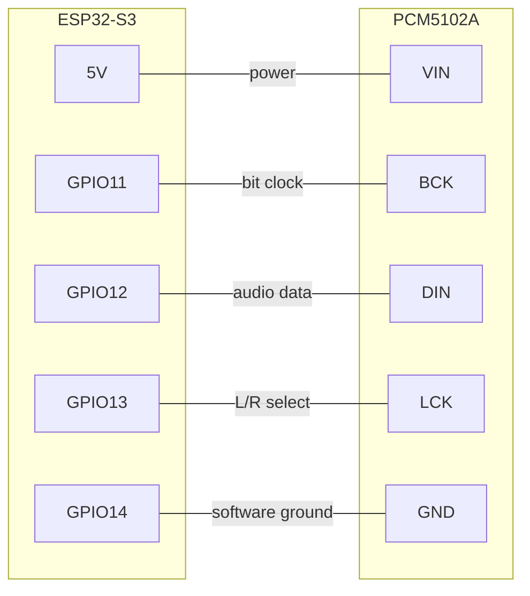

# Assembly

No soldering skills needed. The PCM5102A plugs directly onto the ESP32 pins through a
female header — no breadboard, no jumper wires.

## Step 1 — Prepare the ESP32

The pins on **one side** of the ESP32 need to be removed, or simply not soldered on, so
the assembly fits inside the 3D-printed case. Only the side carrying GPIO11–GPIO14 needs
pins.

If your board arrived with pins already soldered on both sides, carefully desolder or clip
the pins on the opposite side.

## Step 2 — Plug the DAC onto the ESP32

Take a **female 2.54 mm pin header** (6 pins) and push it onto the ESP32 pins on the
GPIO11–14 side. Then insert the PCM5102A into the female header from the other side.

The connections made through the header are:

| ESP32-S3 pin | PCM5102A pin | Function |
| --- | --- | --- |
| 5V | VIN | Power for the DAC |
| GPIO11 | BCK | Bit clock (audio timing) |
| GPIO12 | DIN | Audio data |
| GPIO13 | LCK | Left/right channel select |
| GPIO14 | GND | Software ground, pulled low by the firmware |
| GND | GND | Ground — optional, the GPIO14 software ground is sufficient |

!!! warning "Bridge VIN/VOUT on the ESP32-S3"

    On the ESP32-S3 board, bridge the VIN/VOUT solder pads if they are not already
    connected. This lets the board take 5 V power directly. Without it the DAC will not
    be powered.

## Step 3 — Check the result

Your assembly should look like this:

<figure markdown>
  { width="200" }
  <figcaption>Front</figcaption>
</figure>

<figure markdown>
  { width="200" }
  <figcaption>Back</figcaption>
</figure>

<figure markdown>
  { width="150" }
  <figcaption>Side</figcaption>
</figure>

The PCM5102A sits on top of the ESP32 with the 3.5 mm audio jack sticking out the end.
Plug a USB-C cable into the ESP32 for power.

## Step 4 — Print the case (optional)

A 3D-printable case is provided: [`boite-esp32.stl`](../assets/boite-esp32.stl). Print it
with standard PLA settings. The case is designed for an assembly with pins on one side
only, as described in step 1.

## Next

Head to [Flash the firmware](flashing.md).
