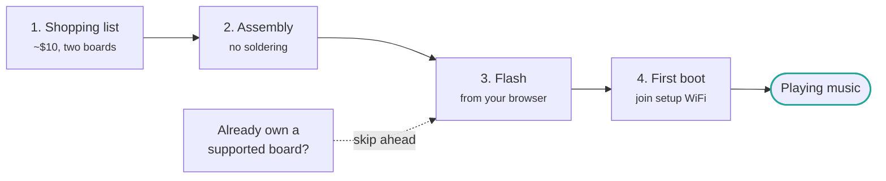

# Getting started

Building an AirPlay speaker from scratch takes four steps and about half an hour, most of
which is waiting for a firmware flash.

1. **[Shopping list](shopping-list.md)** — two boards and a pin header, roughly $10
2. **[Assembly](assembly.md)** — the DAC plugs straight onto the ESP32, no soldering
3. **[Flash the firmware](flashing.md)** — from your browser, or with PlatformIO / ESP-IDF
4. **[First boot](first-boot.md)** — join the setup WiFi and point it at your network

If you already own a [SqueezeAMP](../boards/squeezeamp.md), an
[Esparagus Audio Brick](../boards/esparagus-audio-brick.md) or another supported board,
skip the first two steps and go straight to [flashing](flashing.md) — those boards have a
DAC and amplifier built in.

!!! tip "Which chip should I buy?"

    An **ESP32-S3** is the best default: plenty of RAM, USB-C, and it is what the
    project is developed against. Buy an **original ESP32** instead if you want
    Bluetooth A2DP, which is not available on the S3.
