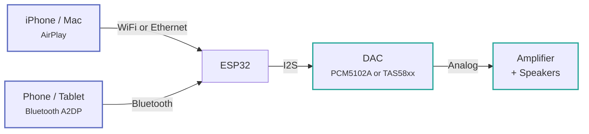
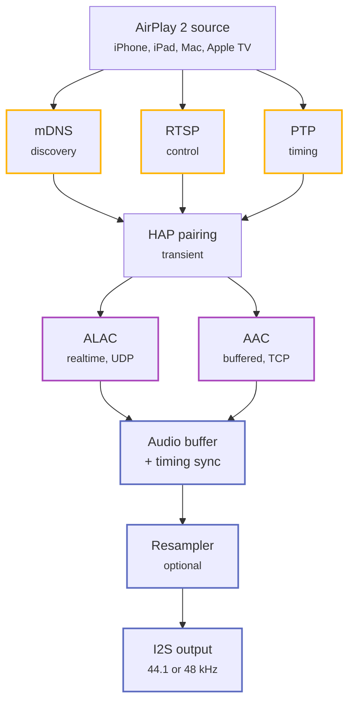
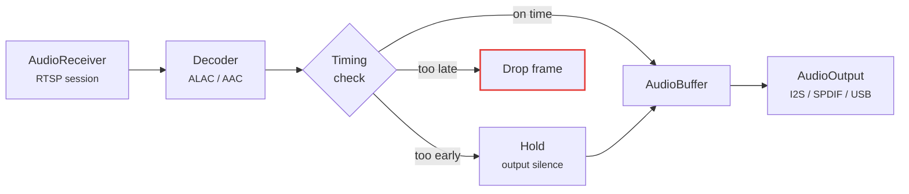
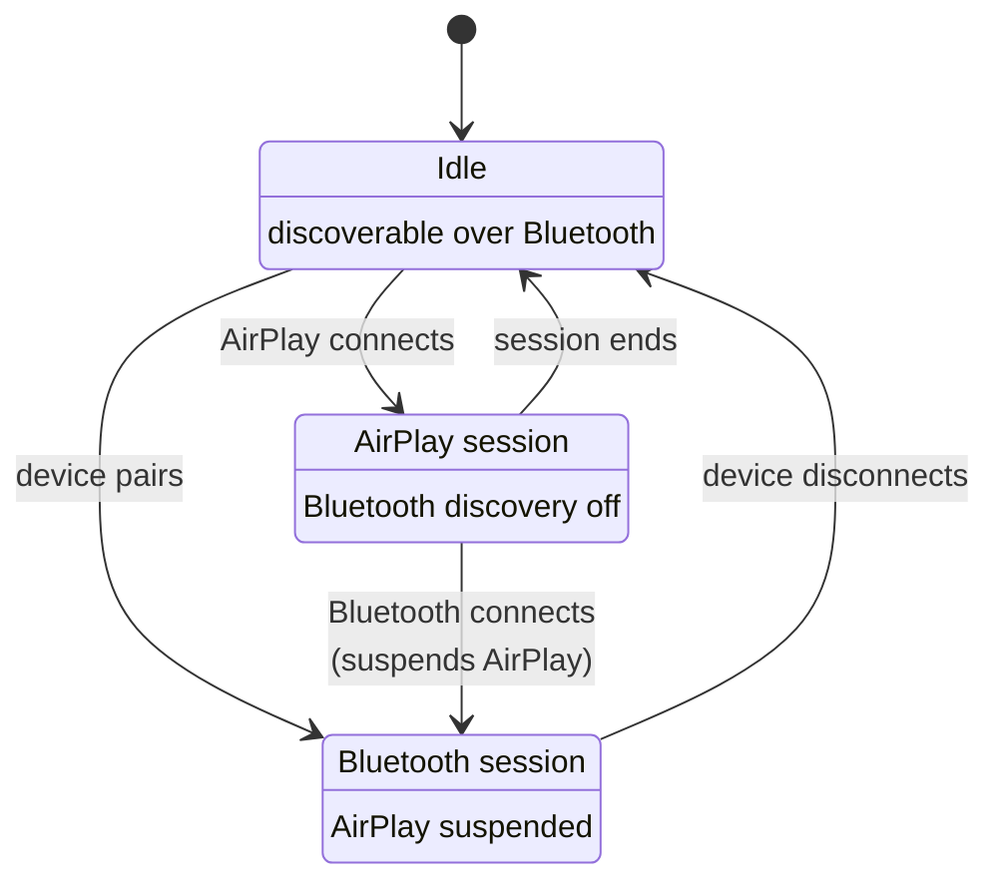

# Architecture

## Signal flow

Audio reaches the board over the network or over Bluetooth, but from the I2S bus onward
both sources share one path.



## Protocol stack

An AirPlay 2 session is really three protocols running side by side. mDNS advertises the
speaker, RTSP carries control, and PTP keeps clocks aligned. Only after HomeKit pairing
completes does audio start flowing.



## Audio pipeline

`AudioReceiver` (RTSP) → decoder → `AudioBuffer` → `AudioOutput` (I2S, S/PDIF or USB).

Two stream types run through it, and the difference between them is the single most
important thing to understand when debugging audio problems.

| Stream | Codec | Transport | Buffering | Timing threshold |
| --- | --- | --- | --- | --- |
| Buffered (AirPlay 2) | AAC | TCP | Deep jitter buffer | 10 ms |
| Realtime (AirPlay 1) | ALAC | UDP | Almost none | 50 ms |

Buffered streams tolerate a tight early/late threshold because the jitter buffer absorbs
network variation. Realtime streams have almost nothing to absorb with, so the same tight
threshold makes them drop out whenever the pipeline stalls — when metadata arrives, for
instance. That is why the two have separate settings; see
[AirPlay tuning](../features/airplay-tuning.md#early-and-late-timing-thresholds).



## I2S signals

| Signal | Function |
| --- | --- |
| BCK | Bit clock — 44100 × 16 × 2 = 1.41 MHz |
| LCK | Word select — toggles at 44.1 kHz |
| DIN | Serial audio data, 16-bit stereo |

MCLK is not used by the PCM5102A, which generates it internally. It is still routed to
GPIO8 by default, which is handy for driving another converter such as a WM8805
I2S-to-S/PDIF bridge.

## Runtime coexistence rules

**AirPlay and Bluetooth are mutually exclusive.** A Bluetooth connection suspends AirPlay;
disconnecting resumes it. While an AirPlay session is active the device stops being
discoverable over Bluetooth, so a stray phone cannot interrupt playback.



**Ethernet is preferred over WiFi at boot**, and both are hot-swappable at runtime. See
[Ethernet](../features/ethernet.md) for the full failover behaviour.

**Display tasks run on core 0, audio tasks on core 1** on dual-core builds. Letting the
LVGL task migrate to core 1 causes progressive audio buffer backpressure — latency climbs
without recovering until the stream misaligns.

## Source layout

```text
main/
├── main.c                      # Entry point — NVS, WiFi, AirPlay services
├── settings.c                  # NVS persistence
├── audio/
│   ├── audio_receiver.c        # RTSP session manager
│   ├── audio_stream_buffered.c # AirPlay 2 AAC, deep jitter buffer
│   ├── audio_stream_realtime.c # AirPlay 1 ALAC, low-latency UDP
│   ├── audio_decoder.c         # ALAC and AAC decoders
│   ├── audio_buffer.c          # Frame buffering
│   ├── audio_timing.c          # PTP-based early/late frame handling
│   ├── audio_resample.c        # 44.1 → 48 kHz conversion
│   ├── audio_output*.c         # I2S, S/PDIF and USB backends
│   └── a2dp_sink.c             # Bluetooth A2DP sink
├── rtsp/                       # RTSP server, handlers, crypto, FairPlay
├── hap/                        # HomeKit pairing — SRP, Ed25519
├── plist/                      # Apple property list parsing
├── network/                    # WiFi, Ethernet, mDNS, PTP, NTP, web server, OTA
├── dacp_client.c               # DACP remote commands
├── playback_control.c          # Unified playback abstraction
└── buttons.c                   # Debounced button input

components/
├── dac/                        # Abstract DAC API, Kconfig-selected
├── dac_tas57xx/                # TAS5756/5754/5751 with hybrid flow DSP
├── dac_tas58xx/                # TAS5825M with on-chip DSP and 15-band EQ
├── display/                    # OLED (u8g2) and ST7789 (LVGL 9) drivers
├── boards/                     # Per-board HAL — GPIOs, SPI bus, init
├── spiffs_storage/             # SPIFFS mount
├── audio-resampler/            # Sinc-based resampler
└── board_utils/                # Board-level utilities
```

## Key components

| Module | Location | Purpose |
| --- | --- | --- |
| RTSP server | `main/rtsp/` | AirPlay control messages |
| HAP pairing | `main/hap/` | Cryptographic device pairing |
| Audio pipeline | `main/audio/` | Decoding, buffering, timing |
| A2DP sink | `main/audio/` | Bluetooth audio receiver, ESP32 only |
| PTP clock | `main/network/` | Synchronisation with the source |
| WiFi | `main/network/` | AP+STA management, captive portal |
| Ethernet | `main/network/` | W5500 SPI driver |
| Web server | `main/network/` | Configuration interface |
| DAC abstraction | `components/dac/` | Kconfig-selected DAC API |
| Board support | `components/boards/` | Per-board HAL |
| Display | `components/display/` | OLED or ST7789 TFT |
| SPIFFS storage | `components/spiffs_storage/` | Filesystem mount |
| Buttons | `main/buttons.c` | Debounced button input |

## Conventions

- **Kconfig drives board selection.** The DAC driver is chosen automatically via
  `CONFIG_DAC_TAS57XX` or `CONFIG_DAC_TAS58XX`. Display, buttons, Bluetooth and Ethernet
  are all Kconfig-gated and compile out entirely when disabled.
- **Each component has its own `CMakeLists.txt`** with `idf_component_register()`.
- **`u8g2` and `u8g2-hal-esp-idf` are git submodules** — always clone with `--recursive`.
