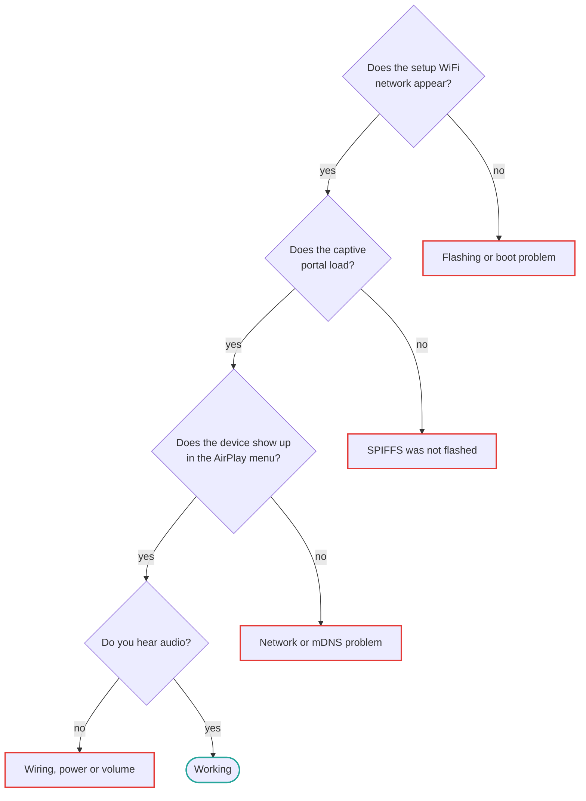

# Troubleshooting

Organised by symptom. Most reports fall into the first three sections.

## Start here



Work down that chain — each stage depends on the one before it, so fixing the earliest
failure often resolves everything after it:

| Where it breaks | Section |
| --- | --- |
| Flashing or boot problem | [No setup network appears](#no-esp32-airplay-setup-network-appears) |
| SPIFFS was not flashed | [The captive portal says "file not found"](#the-captive-portal-says-file-not-found) |
| Network or mDNS problem | [The device does not appear in AirPlay menus](#the-device-does-not-appear-in-airplay-menus) |
| Wiring, power or volume | [Nothing at all, but the device shows up](#nothing-at-all-but-the-device-shows-up-in-airplay) |

## Setup and first boot

### The captive portal says "file not found"

The SPIFFS partition holding the web pages was not flashed. PlatformIO's `-t upload`
writes firmware only.

```bash
pio run -e <env> -t uploadfs
```

With ESP-IDF, `idf.py flash` writes firmware and SPIFFS together, so this does not happen.
See [SPIFFS filesystem](reference/spiffs.md#flashing-the-image).

### No `ESP32-AirPlay-Setup` network appears

Work through these in order:

1. **Wait 30 seconds** after power-up. The AP comes up after NVS and WiFi initialisation.
2. **Check the serial monitor** at 115200 baud (`pio run -e <env> -t monitor`). A boot
   loop or a crash before the WiFi task starts will be visible there.
3. **Confirm the flash actually succeeded.** A merged `.bin` must be written at offset
   `0x0`. Writing it at `0x10000` produces a board that appears to flash fine and then
   does nothing.
4. **Check you flashed the right binary** for your chip. An ESP32 image on an ESP32-S3
   will not boot. See [build environments](reference/build-environments.md).
5. **Look for saved credentials.** If the device already has WiFi credentials it joins
   that network instead of starting the AP. Erase flash to reset:
   `esptool.py erase_flash`.

### The device never joins my WiFi

Only 2.4 GHz networks are supported, except on the ESP32-C5 which is dual-band. WPA3-only
networks will not work — set your router to WPA2 or WPA2/WPA3 mixed mode. After several
failed attempts the device returns to setup mode on its own.

## No sound

### Nothing at all, but the device shows up in AirPlay

Almost always wiring or power on an external DAC build.

1. **Bridge the VIN/VOUT pads on the ESP32-S3.** They ship open on most boards, so the DAC
   gets no 5 V. This is the most common cause.
2. **Check the PCM5102A solder bridges** against
   [the reference photo](getting-started/shopping-list.md#check-the-dac-board).
3. **Verify the I2S pins** match [the defaults](boards/esp32s3-pcm5102a.md#default-i2s-pins)
   — BCK on GPIO11, DIN on GPIO12, LCK on GPIO13.
4. **Check the volume.** Both the sender's volume and the device's own setting in the web
   interface apply.

### Sound from an iPhone but not from a Windows sender

Windows AirPlay senders such as TuneBlade generally speak AirPlay 1 with a realtime ALAC
stream over UDP, which takes a different path through the firmware than AirPlay 2 from
iOS. If it connects but stays silent, try raising the realtime timing threshold — see
[below](#dropouts-crackling-or-stuttering).

Note that Apple Music on Windows is not supported as a sender.

### Silence after pause and resume

Fixed in recent firmware. If you are on an older build, update — see
[OTA updates](reference/ota.md).

## Playback quality

### Dropouts, crackling or stuttering

Start with the realtime timing threshold, especially on AirPlay 1 / ALAC streams where
there is almost no jitter buffer:

```ini
CONFIG_AIRPLAY_RT_TIMING_THRESHOLD_MS=100
```

The default is 50 ms. Raising it trades slightly looser sync for resilience when the
pipeline stalls. Full explanation in
[AirPlay tuning](features/airplay-tuning.md#early-and-late-timing-thresholds).

Other things that help:

- **Disable cover art** if you enabled it. Artwork transfer can stall the audio pipeline.
  It is off by default for this reason.
- **Improve WiFi signal.** The receiver needs a consistent connection; a marginal signal
  produces exactly this symptom.
- **Use Ethernet** if your board supports it — see [Ethernet](features/ethernet.md).

### Out of sync with a HomePod in multi-room

Multi-room sync relies on PTP timing and is sensitive to network jitter. Sync quality also
varies by sender: different iPhone models have shown different behaviour against the same
receiver. There is no configuration that fully resolves this today.

### Audio drops out when a display is connected

On dual-core builds all display work must stay on core 0 so core 1 is free for audio. If
you are building a custom display integration, see the LVGL task affinity notes in the
[display component README](https://github.com/rbouteiller/airplay-esp32/blob/main/components/display/README.md).

## Discovery

### The device does not appear in AirPlay menus

1. **Same network.** The sender and receiver must be on the same subnet. Guest networks
   and client isolation break mDNS.
2. **Flush the macOS mDNS cache** if the device previously crashed — macOS caches AirPlay
   device state and becomes conservative about a device it has seen disappear repeatedly:
   ```bash
   sudo dscacheutil -flushcache
   ```
3. **Check mDNS is not blocked.** Some routers filter multicast between wireless clients.

### The device name shows garbled characters

Non-ASCII device names, Cyrillic for example, were mangled in mDNS advertisements in older
firmware. Update to a recent build.

## Building

### Compilation fails immediately

**Missing submodules** is the usual cause. `u8g2` and `u8g2-hal-esp-idf` are git
submodules:

```bash
git submodule update --init --recursive
```

Clone with `--recursive` to avoid this in the first place.

**Wrong ESP-IDF version.** The project requires **v5.5.5 or newer**. Sendspin needs the
WebSocket post-handshake callback added in that release; an older 5.5.x builds only with
`CONFIG_SENDSPIN_ENABLE=n`. PlatformIO gets 5.5.5 from the pioarduino platform pinned in
`platformio.ini`; the official `platformio/espressif32` platform is still on 5.5.3.

### Changes to sdkconfig defaults have no effect

A generated `sdkconfig.<env>` is cached in the project root and takes priority. Delete it
and rebuild:

```bash
rm sdkconfig.<env>
pio run -e <env> -t build
```

### PlatformIO cannot find a platform for my chip

The official `platformio/espressif32` platform does not support the ESP32-C5, and is stuck
on ESP-IDF 5.5.3. `platformio.ini` pins the community pioarduino platform for every
environment instead — see [Seeed XIAO ESP32-C5](boards/xiao-esp32c5.md).

## Still stuck?

Search the [issue tracker](https://github.com/rbouteiller/airplay-esp32/issues?q=is%3Aissue)
including closed issues, then open a new one or start a
[discussion](https://github.com/rbouteiller/airplay-esp32/discussions).

Include your board, the build environment or prebuilt binary you used, the firmware
version, and serial output at 115200 baud. Serial output makes the difference between a
guess and a diagnosis.
